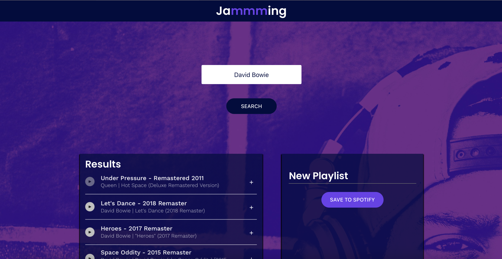

# Jammming

React frontend application for creating playlists and saving them to Spotify.

View live app [here](https://jammming-crk.surge.sh)!

## Table of Contents 
* [Introduction](#introduction)
* [Technologies](#technologies)
* [Set Up](#set-up)
* [Documentation](#documentation)
* [Sources](#sources)

## Intruduction 

This front-end app allows a user to create new playlists and save them to their Spotify account!

After signing in to authorize their Spotify account, the user can search by song, artist, or album. The user can add songs from the search results into a new playlist. The new playlist can be given a name and saved to the user's Spotify account to jammm to later!

UPDATE: The user can listen to 30 second song previews for available songs, in case the user wants to jammm now too!

## Technologies 

[Spotify Web API](https://developer.spotify.com/documentation/web-api/) is used for user authorization and search results. 

* `react` v. 17.0.2
* `react-dom` v. 17.0.2
* `react-scripts` v. 4.0.3
* `npm` v. 7.21.1

## Set Up

Live site hosted by Surge at [jammming-crk.surge.sh](https://jammming-crk.surge.sh).

Or, install locally and run `npm start` in the project root and the app will be available on port 3000.

## Documentation

### Utilities 

- `Spotify` handles access to Spotify. Has three main functions: 
    - `getAccessToken()` handles getting access token for user's spotify account. Will redirect the user to verify their Spotify account if access token expires. 
    - `search(term)` handles fetching search to Spotify based on `term` and returning songs with necessary data. 
    - `savePlaylist()` handles saving a new playlist to the user's Spotify account via a POST fetch request. 

### React Components

- `<App />` class component that handles high level application state management. 
    - Contains functions to add and remove a track from the `<Playlist />` as well as to update the name of the playist.
    - Manages calling `Spotify` search with user input from `<SearchBar />` as well as getting the user's access token on mounting.
    - Manages playing audio preview as well as managing which song's audio preview is playing to ensure only one song preview plays at a time. 

- `<SearchBar />` class component that handles receiving user input of a term to search for. 
    - Renders a text input field and a button to search. 
    - Handles search on 'enter' keyDown or button onClick. 

- `<SearchResults />` class component that renders the results of the Spotify search request. 
    - Renders a `<TrackList />` component to hold the search results. 

- `<Playlist />` class component that renders the songs that have been added to the new playlist by the user.
    - Renders a text input field for changing the playlist name and a `<TrackList />` component to hold the songs in the playlist. 
    - Handles changing the playlist name onChange. 

- `<TrackList />` class component that renders a plurality of `<Track />` components. 
    - Iterates through a set of songs stored in `<Playlist />` or `<SearchResults />`, creating a `<Track />` to render each one. 

- `<Track />`  class component that renders the inforamtion about an individual song. 
    - Renders a song's name, artist, album.
    - Has a button to add/remove the song from the playlist depending on whether the song is currently in the `<Playlist />` or not. 
    - Includes a `<PlayButton />` to play a song preview. 

- `<PlayButton />` class component that provides an option to play a 30 song preview, if available. 
    - Renders a button whose appearance toggles between play/pause when clicked. 
    - Handles providing an updated the song preview to play in the `<AudioBar />` when clicked. 
    - If no song preview is available from Spotify, button appears greyed out. 

- `<AudioBar />` class component that plays the song preview. 
    - Not visible in this app (display: none).

## Sources

This app was created as part of [Codecademy's Fullstack Engineer](https://www.codecademy.com/learn) curriculum. Starter code was provided by Codecademy as well as a guide for completing the project. 